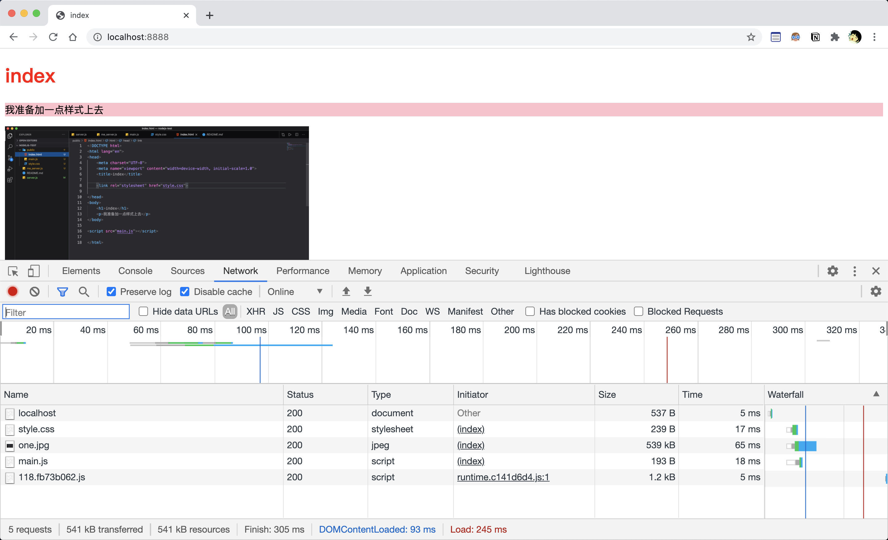

### 核心内容
```
    // 获取文件路径
    let filePath = (path === '/' ? 'index.html' : path);
    // 获取文件的类型
    const fileType = filePath.substring(filePath.indexOf('.'));
    
    const fileTypes = {
        '.html' : 'text/html',
        '.css'  : 'text/css',
        '.js'   : 'text/javascript',
        '.json' : 'text/json',
        '.xml'  : 'text/xml',
        '.jpg'  : 'image/jpeg',
        '.png'  : 'image/png'
    }

    response.setHeader('Content-Type', `${fileTypes[fileType] || 'text/html'};charset=utf-8`);

    let content;
    try {
        response.statusCode = 200;
        content = fs.readFileSync(`./public/${filePath}`);
    } catch (error) {
        response.statusCode = 404;
        content = '文件不存在';
    }
    response.write(content);
    response.end();

```

### 实现的效果

